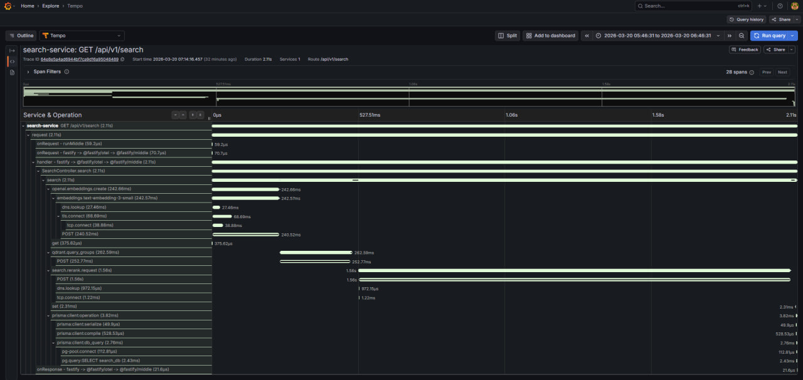

# Library Search Platform

Проєкт реалізує локальну платформу для завантаження EPUB-книг, їх обробки, індексування, векторизації, гібридного пошуку та переранжування результатів. Архітектура складається з окремих сервісів, Kafka, Postgres, Qdrant, Redis, MinIO та observability-контуру на Grafana, Loki, Tempo, Mimir і OpenTelemetry Collector.

## Склад системи

| Сервіс              | Порт            | Призначення                                     |
| ------------------- | --------------- | ----------------------------------------------- |
| `book-service`      | `3001`          | завантаження EPUB, створення книг, підказки     |
| `search-service`    | `3002`          | гібридний пошук, кеш і rerank результатів       |
| `ingestion-worker`  | `3003`          | розпакування EPUB, витяг контенту, векторизація |
| `rerank-service-py` | `3004`          | FastAPI сервіс локального rerank                |
| `postgres`          | `5432`          | основна БД                                      |
| `kafka`             | `9092`          | event bus                                       |
| `debezium connect`  | `8083`          | outbox -> Kafka                                 |
| `kafka-ui`          | `8080`          | перегляд топіків і повідомлень                  |
| `qdrant`            | `6333`          | vector storage                                  |
| `redis`             | `6379`          | кеш rerank                                      |
| `minio`             | `9000` / `9001` | S3-сумісне файлове сховище                      |
| `grafana`           | `4040`          | observability UI                                |
| `otelcol`           | `4317` / `4318` | OTLP collector                                  |

## Observability

- Усі Node.js сервіси стартують з `--import @kigvuzyy/observability/otel/preload`.
- Трейси експортуються в `Tempo`, метрики в `Mimir`, логи в `Loki` через `otelcol`.
- У `Grafana` вже налаштовані datasource для `Mimir`, `Loki` і `Tempo`.
- Для перевірки event-driven частини доступний `Kafka UI`, для файлового сховища `MinIO Console`.

Корисні URL після запуску:

- Grafana: `http://localhost:4040` (`admin` / `admin123`)
- Kafka UI: `http://localhost:8080`
- MinIO Console: `http://localhost:9001` (`minio` / `minio12345678`)
- Qdrant Dashboard: `http://localhost:6333/dashboard`

## Вимоги

- `Docker Desktop` або інший Docker Engine з Compose plugin
- `Node.js >= 25`
- `pnpm 10.30.2`
- `Python 3.11+`
- робочий `OPENAI_API_KEY` для `ingestion-worker` і `search-service`

## Конфігурація середовища

Для локального запуску сервіси читають:

- `apps/book-service/.env`
- `apps/ingestion-worker/.env`
- `apps/search-service/.env`
- `apps/rerank-service-py/.env`

Для запуску через Docker Compose стек читає:

- `observability/env/compose.env`
- `observability/env/*.env`

Усі обов'язкові змінні, приклади значень, коментарі та допустимі режими вже наведені у відповідних шаблонах:

- `apps/*/.env.example`
- `observability/env/*.env.example`

Що потрібно заповнити вручну:

- `apps/ingestion-worker/.env` -> `OPENAI_API_KEY`
- `apps/search-service/.env` -> `OPENAI_API_KEY`
- `observability/env/ingestion-worker.env` -> `OPENAI_API_KEY`
- `observability/env/search-service.env` -> `OPENAI_API_KEY`

Окремо:

- `observability/env/compose.env` містить build-time змінні Docker Compose, зокрема `RERANK_COMPUTE_PROFILE`
- бази `book_db`, `worker_db` і `search_db` створюються init-скриптами Postgres під час першого старту нового volume

## Спосіб 1. Локальний запуск сервісів

У цьому сценарії інфраструктура та observability працюють у Docker, а прикладні сервіси запускаються на хості.

### 1. Підготувати env-файли

Перед запуском потрібно створити робочі `.env` файли для сервісів і Docker Compose за відповідними `*.env.example`.

### 2. Встановити залежності

```bash
pnpm install
```

### 3. Підготувати Python середовище для `rerank-service-py`

CPU-профіль за замовчуванням.

Linux/macOS:

```bash
cd apps/rerank-service-py
python3 -m venv .venv
. .venv/bin/activate
python -m pip install --upgrade pip
python -m pip install --index-url https://download.pytorch.org/whl/cpu torch
python -m pip install -r requirements.cpu.txt
cd ../..
```

Windows (PowerShell):

```powershell
Set-Location apps\rerank-service-py
python -m venv .venv
pnpm run py:install
Set-Location ..\..
```

Якщо потрібен локальний GPU-профіль:

Linux/macOS:

```bash
cd apps/rerank-service-py
. .venv/bin/activate
python -m pip install --upgrade pip
python -m pip install -r requirements.gpu.txt
cd ../..
```

Windows (PowerShell):

```powershell
Set-Location apps\rerank-service-py
pnpm run py:install:gpu
Set-Location ..\..
```

Також у `apps/rerank-service-py/.env` потрібно виставити:

- `RERANK_DEVICE=cpu` для CPU
- `RERANK_DEVICE=cuda` для GPU

### 4. Підняти інфраструктуру та observability

Linux/macOS:

```bash
docker compose \
  --env-file observability/env/compose.env \
  -f observability/compose/docker-compose.yaml \
  -f observability/compose/compose.dev.core.yaml \
  -f observability/compose/compose.dev.otel.yaml \
  up -d
```

Windows (PowerShell):

```powershell
docker compose `
  --env-file observability/env/compose.env `
  -f observability/compose/docker-compose.yaml `
  -f observability/compose/compose.dev.core.yaml `
  -f observability/compose/compose.dev.otel.yaml `
  up -d
```

### 5. Застосувати Prisma migrations

```bash
pnpm --dir apps/book-service exec prisma migrate deploy --schema ./prisma/schema
pnpm --dir apps/ingestion-worker exec prisma migrate deploy --schema ./prisma/schema
pnpm --dir apps/search-service exec prisma migrate deploy --schema ./prisma/schema
```

### 6. Зареєструвати Debezium connectors

Linux/macOS:

```bash
curl -X PUT \
  http://localhost:8083/connectors/pg-book-outbox/config \
  -H 'Content-Type: application/json' \
  --data @observability/config/debezium/connectors/pg-book-outbox.config.json

curl -X PUT \
  http://localhost:8083/connectors/pg-worker-outbox/config \
  -H 'Content-Type: application/json' \
  --data @observability/config/debezium/connectors/pg-worker-outbox.config.json
```

Windows (PowerShell):

```powershell
curl.exe -X PUT `
  http://localhost:8083/connectors/pg-book-outbox/config `
  -H "Content-Type: application/json" `
  --data @observability/config/debezium/connectors/pg-book-outbox.config.json

curl.exe -X PUT `
  http://localhost:8083/connectors/pg-worker-outbox/config `
  -H "Content-Type: application/json" `
  --data @observability/config/debezium/connectors/pg-worker-outbox.config.json
```

### 7. Зібрати Node.js сервіси

```bash
pnpm --dir apps/book-service build
pnpm --dir apps/ingestion-worker build
pnpm --dir apps/search-service build
```

### 8. Запустити сервіси локально

Node.js сервіси запускаються в окремих терміналах.

```bash
pnpm --dir apps/book-service start
pnpm --dir apps/ingestion-worker start
pnpm --dir apps/search-service start
```

`rerank-service-py`:

Linux/macOS:

```bash
cd apps/rerank-service-py
.venv/bin/python run.py
```

Windows (PowerShell):

```powershell
pnpm --dir apps/rerank-service-py start
```

## Спосіб 2. Повний запуск через Docker Compose

У цьому сценарії інфраструктура, observability і всі застосунки запускаються в Docker.

### 1. Підготувати env-файли

Перед запуском потрібно створити робочі `observability/env/*.env` за відповідними `observability/env/*.env.example`.

### 2. Встановити залежності

```bash
pnpm install
```

### 3. Підняти інфраструктуру та observability

Linux/macOS:

```bash
docker compose \
  --env-file observability/env/compose.env \
  -f observability/compose/docker-compose.yaml \
  -f observability/compose/compose.dev.core.yaml \
  -f observability/compose/compose.dev.otel.yaml \
  up -d
```

Windows (PowerShell):

```powershell
docker compose `
  --env-file observability/env/compose.env `
  -f observability/compose/docker-compose.yaml `
  -f observability/compose/compose.dev.core.yaml `
  -f observability/compose/compose.dev.otel.yaml `
  up -d
```

### 4. Застосувати Prisma migrations

```bash
pnpm --dir apps/book-service exec prisma migrate deploy --schema ./prisma/schema
pnpm --dir apps/ingestion-worker exec prisma migrate deploy --schema ./prisma/schema
pnpm --dir apps/search-service exec prisma migrate deploy --schema ./prisma/schema
```

### 5. Зареєструвати Debezium connectors

Linux/macOS:

```bash
curl -X PUT \
  http://localhost:8083/connectors/pg-book-outbox/config \
  -H 'Content-Type: application/json' \
  --data @observability/config/debezium/connectors/pg-book-outbox.config.json

curl -X PUT \
  http://localhost:8083/connectors/pg-worker-outbox/config \
  -H 'Content-Type: application/json' \
  --data @observability/config/debezium/connectors/pg-worker-outbox.config.json
```

Windows (PowerShell):

```powershell
curl.exe -X PUT `
  http://localhost:8083/connectors/pg-book-outbox/config `
  -H "Content-Type: application/json" `
  --data @observability/config/debezium/connectors/pg-book-outbox.config.json

curl.exe -X PUT `
  http://localhost:8083/connectors/pg-worker-outbox/config `
  -H "Content-Type: application/json" `
  --data @observability/config/debezium/connectors/pg-worker-outbox.config.json
```

### 6. Зібрати й запустити застосунки

Linux/macOS:

```bash
docker compose \
  --env-file observability/env/compose.env \
  -f observability/compose/docker-compose.yaml \
  -f observability/compose/compose.dev.core.yaml \
  -f observability/compose/compose.dev.otel.yaml \
  --profile apps up -d --build
```

Windows (PowerShell):

```powershell
docker compose `
  --env-file observability/env/compose.env `
  -f observability/compose/docker-compose.yaml `
  -f observability/compose/compose.dev.core.yaml `
  -f observability/compose/compose.dev.otel.yaml `
  --profile apps up -d --build
```

Цей крок:

- збирає образи `book-service`, `ingestion-worker`, `search-service`, `rerank-service-py`
- піднімає їх у тому ж Compose-контурі
- використовує окремий env-файл для кожного сервісу з `observability/env`

Для `rerank-service-py` перший старт може тривати довше, бо модель завантажується локально. HF cache винесений у named volume `rerank_hf_cache`, тому після пересоздання контейнера модель і артефакти перевикористовуються.

### GPU-профіль для Docker Compose

Для GPU-режиму:

- у `observability/env/compose.env` виставте `RERANK_COMPUTE_PROFILE=gpu`
- у `observability/env/rerank-service-py.env` виставте `RERANK_DEVICE=cuda`
- запускайте Compose з `observability/compose/compose.services.gpu.yaml`

Linux/macOS:

```bash
docker compose \
  --env-file observability/env/compose.env \
  -f observability/compose/docker-compose.yaml \
  -f observability/compose/compose.dev.core.yaml \
  -f observability/compose/compose.dev.otel.yaml \
  -f observability/compose/compose.services.gpu.yaml \
  --profile apps up -d --build
```

Windows (PowerShell):

```powershell
docker compose `
  --env-file observability/env/compose.env `
  -f observability/compose/docker-compose.yaml `
  -f observability/compose/compose.dev.core.yaml `
  -f observability/compose/compose.dev.otel.yaml `
  -f observability/compose/compose.services.gpu.yaml `
  --profile apps up -d --build
```

Для GPU-профілю потрібен робочий Docker GPU runtime на хості.

## Перевірка після запуску

Health endpoints:

- `http://localhost:3001/api/health/live`
- `http://localhost:3001/api/health/ready`
- `http://localhost:3002/api/health/live`
- `http://localhost:3002/api/health/ready`
- `http://localhost:3003/api/health/live`
- `http://localhost:3003/api/health/ready`
- `http://localhost:3004/health`

### Приклад пошуку

Приклад запиту:

```text
GET http://localhost:3002/api/v1/search?q=Квантовая механика
```

Як працює цей запит:

1. `search-service` приймає текст запиту та формує набір кандидатів.
2. У `Qdrant` виконується гібридний пошук:
   dense-вектори використовуються для semantic similarity
   sparse-вектори використовуються для lexical matching
3. Первинний список кандидатів передається в `rerank-service-py`.
4. Модель rerank переобчислює релевантність і повертає фінальний порядок результатів.
5. API віддає клієнту пагінований список книг із метаданими.

Поточний локальний стенд:

- `Qdrant`: близько `200` книг
- `Qdrant`: близько `41 500` points dense-векторів розмірності `1536`
- `Qdrant`: близько `41 500` points sparse-векторів
- `RERANK_MODEL=onnx-community/bge-reranker-v2-m3-ONNX`
- `RERANK_BACKEND=onnx`
- `RERANK_DEVICE=gpu` на `RTX 3070`

Приклад відповіді:

```json
{
	"offset": 0,
	"limit": 20,
	"nextOffset": 20,
	"items": [
		{
			"score": 0.8333334,
			"rerankScore": 0.9775040149688721,
			"bookId": "28328044468895744",
			"title": "Сто лет недосказанности. Квантовая механика для всех в 25 эссе",
			"description": null,
			"coverObjectKey": "books/28328044468895744/cover/original.jpg",
			"authors": ["Семихатов А.М."]
		},
		{
			"score": 0.8333334,
			"rerankScore": 0.9610480666160583,
			"bookId": "28328626667651072",
			"title": "Исследование о природе и причинах богатства народов (Великие экономисты)",
			"description": null,
			"coverObjectKey": "books/28328626667651072/cover/original.jpg",
			"authors": ["Адам Смит"]
		},
		{
			"score": 0.045548655,
			"rerankScore": 0.7782214283943176,
			"bookId": "28334719351390208",
			"title": "Бесконечная сила. [...] - (МИФ. Научпоп)",
			"description": null,
			"coverObjectKey": "books/28334719351390208/cover/original.jpg",
			"authors": ["Строгац Стивен"]
		}
	]
}
```

Як інтерпретувати поля:

- `offset`, `limit`, `nextOffset` відповідають за пагінацію
- `score` це оцінка первинного гібридного пошуку
- `rerankScore` це оцінка після повторного переранжування моделлю
- `bookId`, `title`, `authors`, `coverObjectKey` це метадані книги для побудови UI або подальшої API-відповіді

У цьому прикладі першим результатом повертається книга про квантову механіку з найвищим `rerankScore`, тобто rerank-модель визнала її найбільш релевантною до запиту. Це добре показує різницю між первинним пошуком по індексу та фінальним упорядкуванням результатів.

Trace холодного запиту на пошук з Grafana/Tempo:

